# End-to-End Flow Design - Ping Pong League Manager

## **1. User Journey Overview**

### **Target Users**
- **Primary:** Adults 40+ years old
- **Secondary:** Tournament organizers, referees, club managers
- **Characteristics:** Less tech-savvy, prefer simple interfaces, need clear guidance

---

## **2. Authentication Flow**

### **2.1. User Registration/Login Flow**

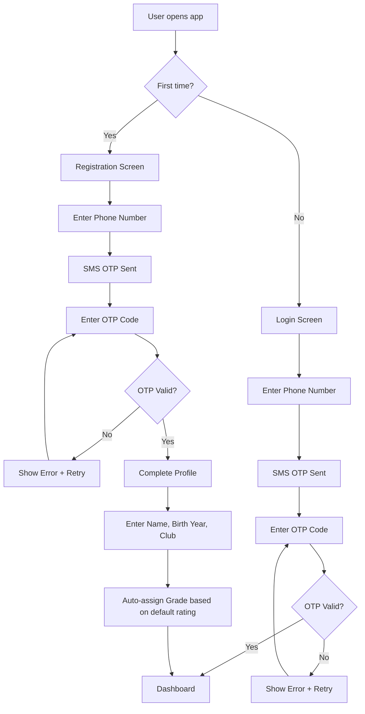
```mermaid
graph TD
    A[User opens app] --> B{First time?}
    B -->|Yes| C[Registration Screen]
    B -->|No| D[Login Screen]
    
    C --> E[Enter Phone Number]
    E --> F[SMS OTP Sent]
    F --> G[Enter OTP Code]
    G --> H{OTP Valid?}
    H -->|No| I[Show Error + Retry]
    H -->|Yes| J[Complete Profile]
    I --> G
    
    D --> K[Enter Phone Number]
    K --> L[SMS OTP Sent]
    L --> M[Enter OTP Code]
    M --> N{OTP Valid?}
    N -->|No| O[Show Error + Retry]
    N -->|Yes| P[Dashboard]
    O --> M
    
    J --> Q[Enter Name, Birth Year, Club]
    Q --> R[Auto-assign Grade based on default rating]
    R --> P[Dashboard]
```

### **2.2. Profile Setup Flow**
```
Registration → Phone Verification → Profile Info → Grade Assignment → Dashboard
     ↓              ↓                ↓              ↓               ↓
- Phone number  - SMS OTP        - Full name    - Auto: Rating  - Welcome
- reCAPTCHA     - 6-digit code   - Birth year   - Points: 1200  - Onboarding
- Rate limit    - 3 attempts     - Club name    - Grade: B      - Tutorial
```

---

## **3. Tournament Management Flow**

### **3.1. Organizer Tournament Creation**

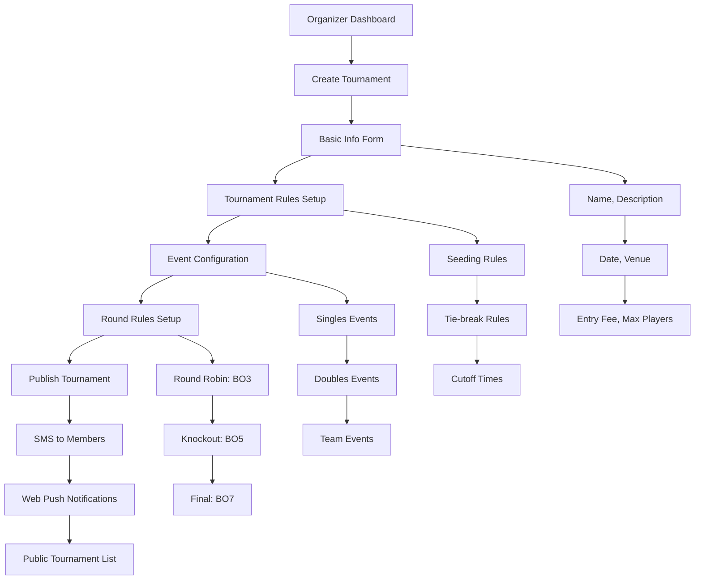
```mermaid
graph TD
    A[Organizer Dashboard] --> B[Create Tournament]
    B --> C[Basic Info Form]
    C --> D[Tournament Rules Setup]
    D --> E[Event Configuration]
    E --> F[Round Rules Setup]
    F --> G[Publish Tournament]
    
    C --> C1[Name, Description]
    C1 --> C2[Date, Venue]
    C2 --> C3[Entry Fee, Max Players]
    
    D --> D1[Seeding Rules]
    D1 --> D2[Tie-break Rules]
    D2 --> D3[Cutoff Times]
    
    E --> E1[Singles Events]
    E1 --> E2[Doubles Events]
    E2 --> E3[Team Events]
    
    F --> F1[Round Robin: BO3]
    F1 --> F2[Knockout: BO5]
    F2 --> F3[Final: BO7]
    
    G --> H[SMS to Members]
    H --> I[Web Push Notifications]
    I --> J[Public Tournament List]
```

### **3.2. Event Registration Flow**

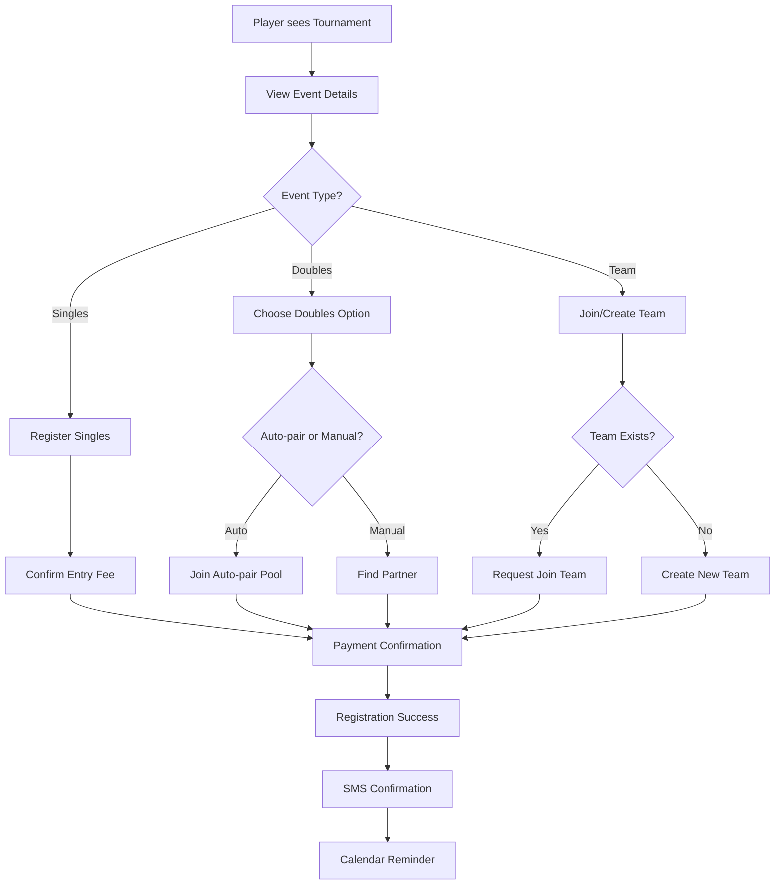
```mermaid
graph TD
    A[Player sees Tournament] --> B[View Event Details]
    B --> C{Event Type?}
    
    C -->|Singles| D[Register Singles]
    C -->|Doubles| E[Choose Doubles Option]
    C -->|Team| F[Join/Create Team]
    
    D --> G[Confirm Entry Fee]
    E --> H{Auto-pair or Manual?}
    H -->|Auto| I[Join Auto-pair Pool]
    H -->|Manual| J[Find Partner]
    
    F --> K{Team Exists?}
    K -->|Yes| L[Request Join Team]
    K -->|No| M[Create New Team]
    
    G --> N[Payment Confirmation]
    I --> N
    J --> N
    L --> N
    M --> N
    
    N --> O[Registration Success]
    O --> P[SMS Confirmation]
    P --> Q[Calendar Reminder]
```

---

## **4. Tournament Execution Flow**

### **4.1. Pre-Tournament Setup**

```mermaid
graph TD
    A[Registration Closes] --> B[Auto High-Low Pairing]
    B --> C[Generate Brackets]
    C --> D[Seed Players by Rating]
    D --> E[Schedule Generation]
    E --> F[Court Assignment]
    F --> G[Publish Schedule]
    
    B --> B1[Sort by Rating Points]
    B1 --> B2[Split into 2 Groups]
    B2 --> B3[Pair High[i] with Low[i]]
    
    C --> C1[Round Robin Groups]
    C1 --> C2[Knockout Brackets]
    C2 --> C3[Consolation Brackets]
    
    E --> E1[Consider Court Count]
    E1 --> E2[Avoid Player Conflicts]
    E2 --> E3[Optimize Time Slots]
    
    G --> H[PDF Bracket Export]
    H --> I[Web Push to Players]
    I --> J[SMS Reminders]
```

### **4.2. Match Execution Flow**

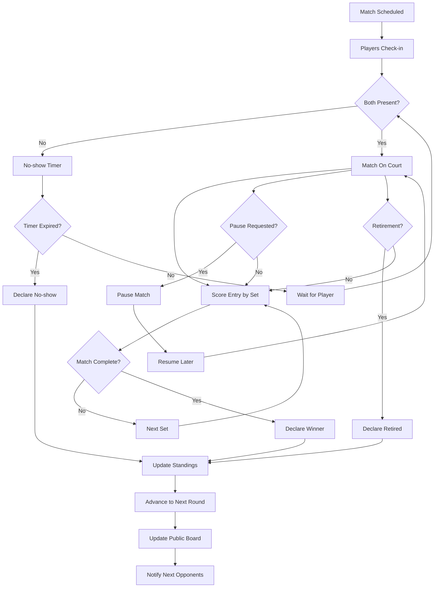
```mermaid
graph TD
    A[Match Scheduled] --> B[Players Check-in]
    B --> C{Both Present?}
    C -->|No| D[No-show Timer]
    C -->|Yes| E[Match On Court]
    
    D --> F{Timer Expired?}
    F -->|Yes| G[Declare No-show]
    F -->|No| H[Wait for Player]
    H --> C
    
    E --> I[Score Entry by Set]
    I --> J{Match Complete?}
    J -->|No| K[Next Set]
    J -->|Yes| L[Declare Winner]
    K --> I
    
    G --> M[Update Standings]
    L --> M
    M --> N[Advance to Next Round]
    N --> O[Update Public Board]
    O --> P[Notify Next Opponents]
    
    E --> Q{Pause Requested?}
    Q -->|Yes| R[Pause Match]
    Q -->|No| I
    R --> S[Resume Later]
    S --> E
    
    E --> T{Retirement?}
    T -->|Yes| U[Declare Retired]
    T -->|No| I
    U --> M
```

### **4.3. Real-time Updates Flow**

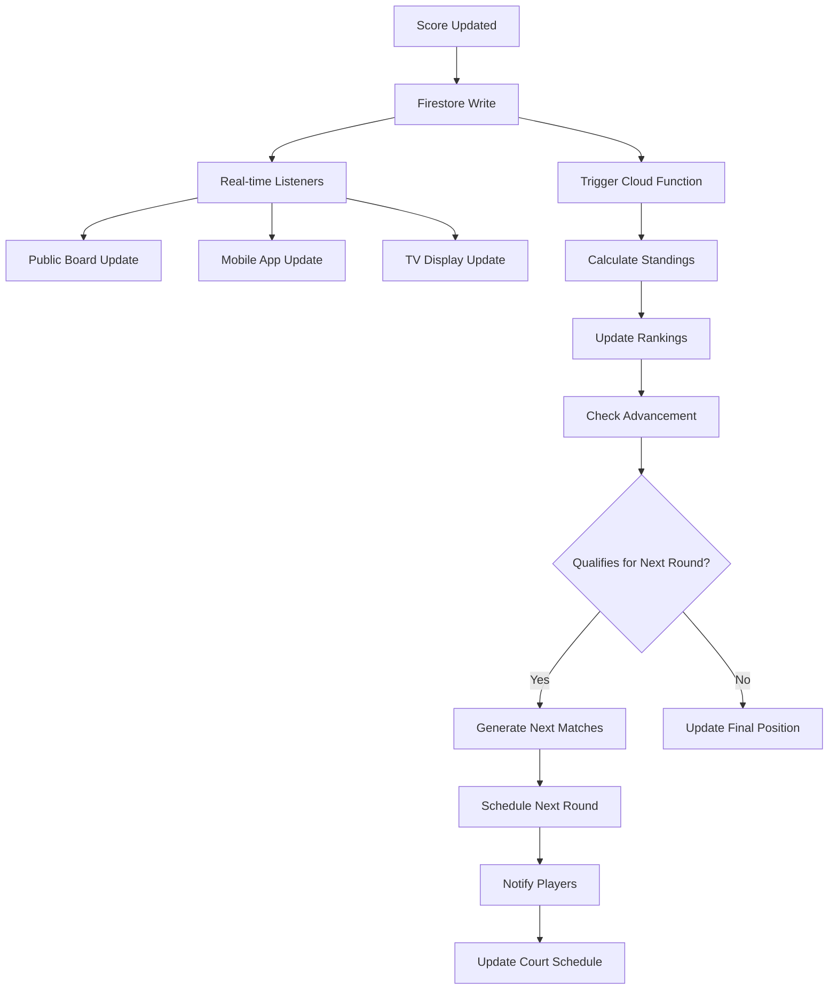
```mermaid
graph TD
    A[Score Updated] --> B[Firestore Write]
    B --> C[Real-time Listeners]
    C --> D[Public Board Update]
    C --> E[Mobile App Update]
    C --> F[TV Display Update]
    
    B --> G[Trigger Cloud Function]
    G --> H[Calculate Standings]
    H --> I[Update Rankings]
    I --> J[Check Advancement]
    J --> K{Qualifies for Next Round?}
    K -->|Yes| L[Generate Next Matches]
    K -->|No| M[Update Final Position]
    
    L --> N[Schedule Next Round]
    N --> O[Notify Players]
    O --> P[Update Court Schedule]
```

---

## **5. Court Management Flow**

### **5.1. Real-time Court Coordination**

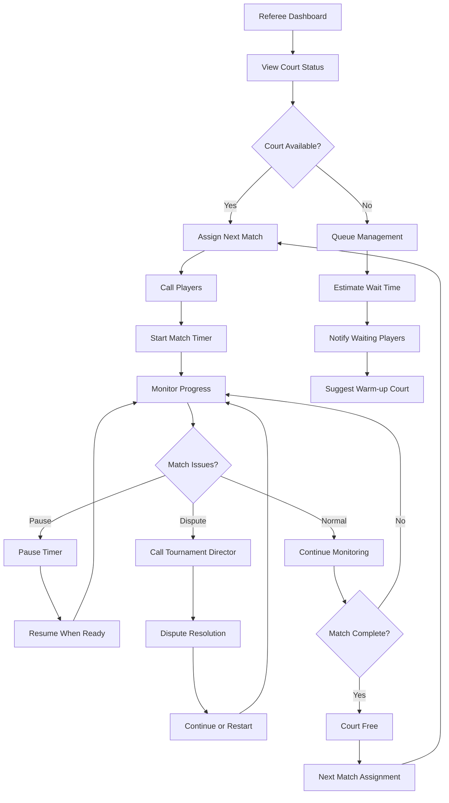
```mermaid
graph TD
    A[Referee Dashboard] --> B[View Court Status]
    B --> C{Court Available?}
    C -->|Yes| D[Assign Next Match]
    C -->|No| E[Queue Management]
    
    D --> F[Call Players]
    F --> G[Start Match Timer]
    G --> H[Monitor Progress]
    
    E --> I[Estimate Wait Time]
    I --> J[Notify Waiting Players]
    J --> K[Suggest Warm-up Court]
    
    H --> L{Match Issues?}
    L -->|Pause| M[Pause Timer]
    L -->|Dispute| N[Call Tournament Director]
    L -->|Normal| O[Continue Monitoring]
    
    M --> P[Resume When Ready]
    P --> H
    
    N --> Q[Dispute Resolution]
    Q --> R[Continue or Restart]
    R --> H
    
    O --> S{Match Complete?}
    S -->|Yes| T[Court Free]
    S -->|No| H
    T --> U[Next Match Assignment]
    U --> D
```

### **5.2. Emergency Handling Flow**

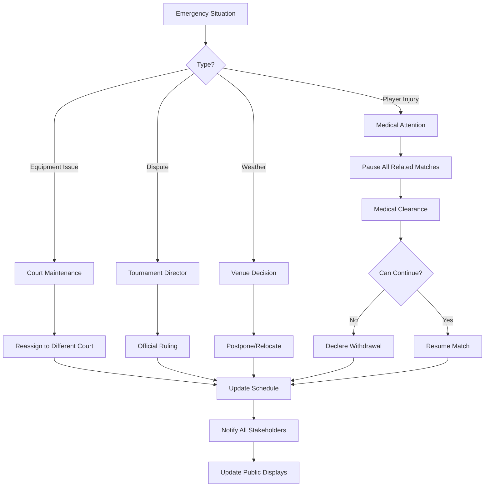
```mermaid
graph TD
    A[Emergency Situation] --> B{Type?}
    B -->|Player Injury| C[Medical Attention]
    B -->|Equipment Issue| D[Court Maintenance]
    B -->|Dispute| E[Tournament Director]
    B -->|Weather| F[Venue Decision]
    
    C --> G[Pause All Related Matches]
    D --> H[Reassign to Different Court]
    E --> I[Official Ruling]
    F --> J[Postpone/Relocate]
    
    G --> K[Medical Clearance]
    K --> L{Can Continue?}
    L -->|Yes| M[Resume Match]
    L -->|No| N[Declare Withdrawal]
    
    H --> O[Update Schedule]
    I --> O
    J --> O
    N --> O
    M --> O
    
    O --> P[Notify All Stakeholders]
    P --> Q[Update Public Displays]
```

---

## **6. Notification Flow**

### **6.1. Multi-channel Notification System**

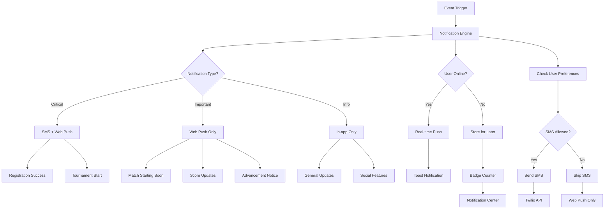
```mermaid
graph TD
    A[Event Trigger] --> B[Notification Engine]
    B --> C{Notification Type?}
    
    C -->|Critical| D[SMS + Web Push]
    C -->|Important| E[Web Push Only]
    C -->|Info| F[In-app Only]
    
    D --> G[Registration Success]
    D --> H[Tournament Start]
    
    E --> I[Match Starting Soon]
    E --> J[Score Updates]
    E --> K[Advancement Notice]
    
    F --> L[General Updates]
    F --> M[Social Features]
    
    B --> N{User Online?}
    N -->|Yes| O[Real-time Push]
    N -->|No| P[Store for Later]
    
    O --> Q[Toast Notification]
    P --> R[Badge Counter]
    R --> S[Notification Center]
    
    B --> T[Check User Preferences]
    T --> U{SMS Allowed?}
    U -->|Yes| V[Send SMS]
    U -->|No| W[Skip SMS]
    
    V --> X[Twilio API]
    W --> Y[Web Push Only]
```

### **6.2. Notification Content Strategy**

```
Registration Success (SMS):
"Chúc mừng! Bạn đã đăng ký thành công giải [Tournament]. Chi tiết: [Link]. BTC: [Phone]"

Match Starting (Web Push):
"Trận đấu của bạn sẽ bắt đầu trong 15 phút. Sân: [Court]. Đối thủ: [Opponent]"

Tournament Results (In-app):
"Kết quả chính thức giải [Tournament]. Xem chi tiết tại mục Kết Quả."
```

---

## **7. Payment & Financial Flow**

### **7.1. Fee Collection Process**

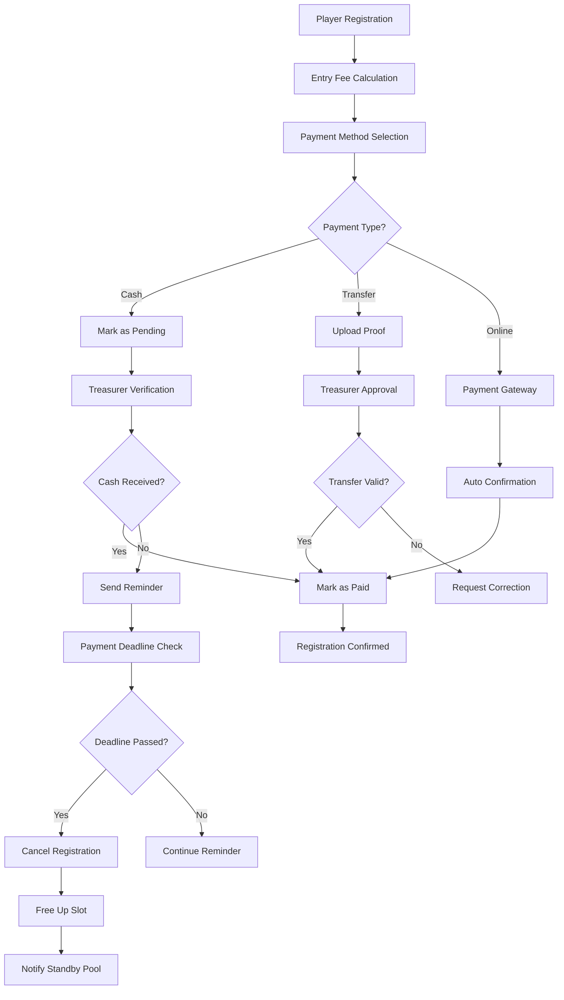
```mermaid
graph TD
    A[Player Registration] --> B[Entry Fee Calculation]
    B --> C[Payment Method Selection]
    C --> D{Payment Type?}
    
    D -->|Cash| E[Mark as Pending]
    D -->|Transfer| F[Upload Proof]
    D -->|Online| G[Payment Gateway]
    
    E --> H[Treasurer Verification]
    F --> I[Treasurer Approval]
    G --> J[Auto Confirmation]
    
    H --> K{Cash Received?}
    K -->|Yes| L[Mark as Paid]
    K -->|No| M[Send Reminder]
    
    I --> N{Transfer Valid?}
    N -->|Yes| L
    N -->|No| O[Request Correction]
    
    J --> L
    L --> P[Registration Confirmed]
    
    M --> Q[Payment Deadline Check]
    Q --> R{Deadline Passed?}
    R -->|Yes| S[Cancel Registration]
    R -->|No| T[Continue Reminder]
    
    S --> U[Free Up Slot]
    U --> V[Notify Standby Pool]
```

### **7.2. Financial Reporting Flow**

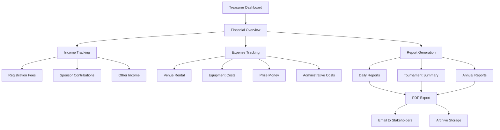
```mermaid
graph TD
    A[Treasurer Dashboard] --> B[Financial Overview]
    B --> C[Income Tracking]
    B --> D[Expense Tracking]
    B --> E[Report Generation]
    
    C --> F[Registration Fees]
    C --> G[Sponsor Contributions]
    C --> H[Other Income]
    
    D --> I[Venue Rental]
    D --> J[Equipment Costs]
    D --> K[Prize Money]
    D --> L[Administrative Costs]
    
    E --> M[Daily Reports]
    E --> N[Tournament Summary]
    E --> O[Annual Reports]
    
    M --> P[PDF Export]
    N --> P
    O --> P
    P --> Q[Email to Stakeholders]
    P --> R[Archive Storage]
```

---

## **8. Public Display Flow**

### **8.1. Live Tournament Board**

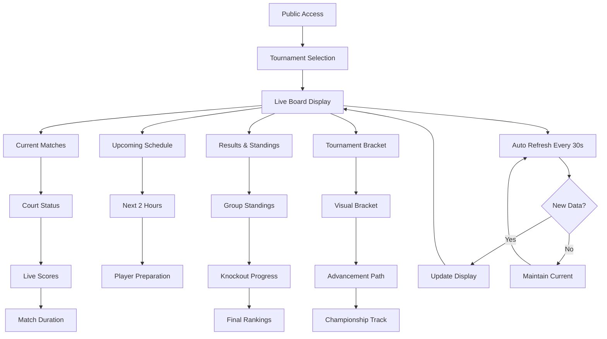
```mermaid
graph TD
    A[Public Access] --> B[Tournament Selection]
    B --> C[Live Board Display]
    C --> D[Auto Refresh Every 30s]
    
    C --> E[Current Matches]
    C --> F[Upcoming Schedule]
    C --> G[Results & Standings]
    C --> H[Tournament Bracket]
    
    E --> I[Court Status]
    I --> J[Live Scores]
    J --> K[Match Duration]
    
    F --> L[Next 2 Hours]
    L --> M[Player Preparation]
    
    G --> N[Group Standings]
    N --> O[Knockout Progress]
    O --> P[Final Rankings]
    
    H --> Q[Visual Bracket]
    Q --> R[Advancement Path]
    R --> S[Championship Track]
    
    D --> T{New Data?}
    T -->|Yes| U[Update Display]
    T -->|No| V[Maintain Current]
    U --> C
    V --> D
```

### **8.2. Search & Filter System**

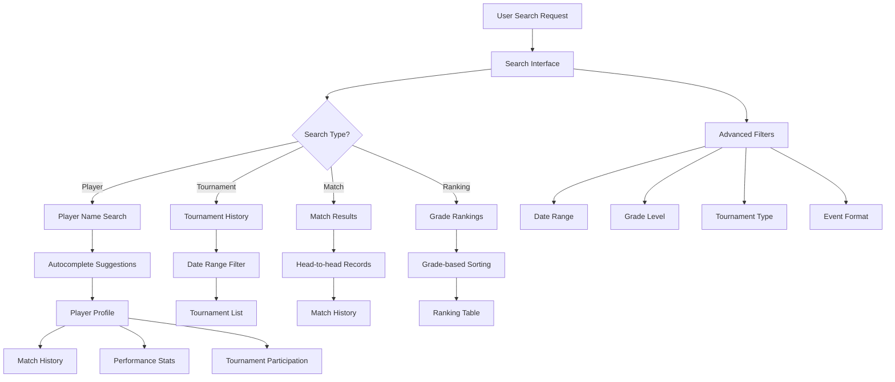
```mermaid
graph TD
    A[User Search Request] --> B[Search Interface]
    B --> C{Search Type?}
    
    C -->|Player| D[Player Name Search]
    C -->|Tournament| E[Tournament History]
    C -->|Match| F[Match Results]
    C -->|Ranking| G[Grade Rankings]
    
    D --> H[Autocomplete Suggestions]
    E --> I[Date Range Filter]
    F --> J[Head-to-head Records]
    G --> K[Grade-based Sorting]
    
    H --> L[Player Profile]
    I --> M[Tournament List]
    J --> N[Match History]
    K --> O[Ranking Table]
    
    L --> P[Match History]
    L --> Q[Performance Stats]
    L --> R[Tournament Participation]
    
    B --> S[Advanced Filters]
    S --> T[Date Range]
    S --> U[Grade Level]
    S --> V[Tournament Type]
    S --> W[Event Format]
```

---

## **9. Data Synchronization Flow**

### **9.1. Real-time Data Flow**

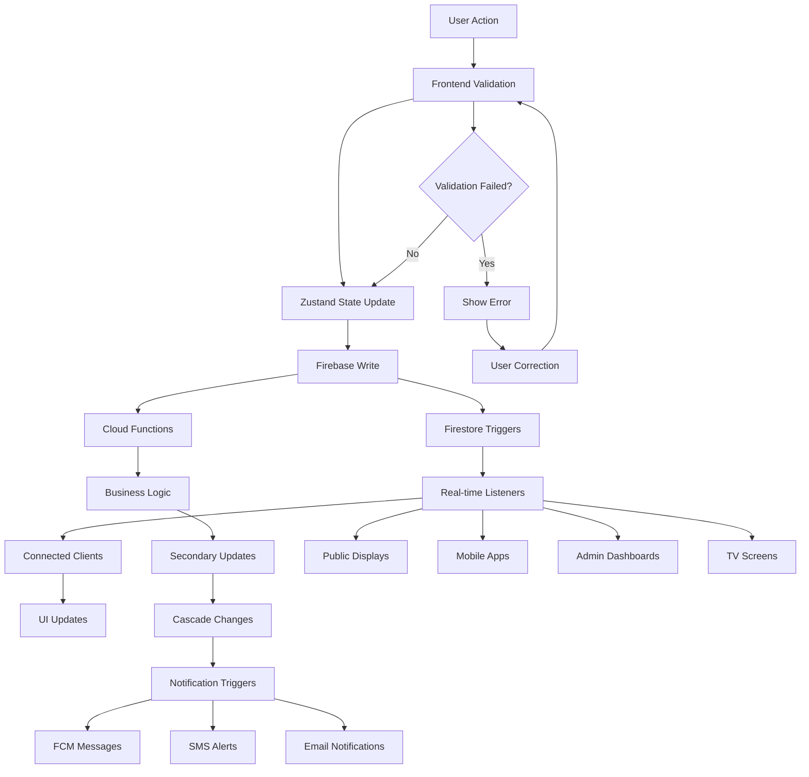
```mermaid
graph TD
    A[User Action] --> B[Frontend Validation]
    B --> C[Zustand State Update]
    C --> D[Firebase Write]
    D --> E[Firestore Triggers]
    
    E --> F[Real-time Listeners]
    F --> G[Connected Clients]
    G --> H[UI Updates]
    
    D --> I[Cloud Functions]
    I --> J[Business Logic]
    J --> K[Secondary Updates]
    K --> L[Cascade Changes]
    
    B --> M{Validation Failed?}
    M -->|Yes| N[Show Error]
    M -->|No| C
    N --> O[User Correction]
    O --> B
    
    F --> P[Public Displays]
    F --> Q[Mobile Apps]
    F --> R[Admin Dashboards]
    F --> S[TV Screens]
    
    L --> T[Notification Triggers]
    T --> U[FCM Messages]
    T --> V[SMS Alerts]
    T --> W[Email Notifications]
```

### **9.2. Offline Handling Flow**

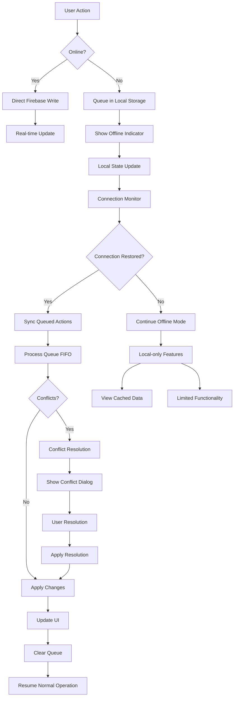
```mermaid
graph TD
    A[User Action] --> B{Online?}
    B -->|Yes| C[Direct Firebase Write]
    B -->|No| D[Queue in Local Storage]
    
    C --> E[Real-time Update]
    D --> F[Show Offline Indicator]
    F --> G[Local State Update]
    
    G --> H[Connection Monitor]
    H --> I{Connection Restored?}
    I -->|No| J[Continue Offline Mode]
    I -->|Yes| K[Sync Queued Actions]
    
    K --> L[Process Queue FIFO]
    L --> M{Conflicts?}
    M -->|Yes| N[Conflict Resolution]
    M -->|No| O[Apply Changes]
    
    N --> P[Show Conflict Dialog]
    P --> Q[User Resolution]
    Q --> R[Apply Resolution]
    R --> O
    
    O --> S[Update UI]
    S --> T[Clear Queue]
    T --> U[Resume Normal Operation]
    
    J --> V[Local-only Features]
    V --> W[View Cached Data]
    V --> X[Limited Functionality]
```

---

## **10. Error Handling & Recovery Flow**

### **10.1. System Error Handling**

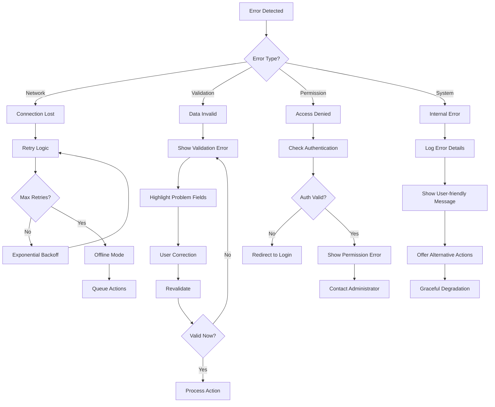
```mermaid
graph TD
    A[Error Detected] --> B{Error Type?}
    
    B -->|Network| C[Connection Lost]
    B -->|Validation| D[Data Invalid]
    B -->|Permission| E[Access Denied]
    B -->|System| F[Internal Error]
    
    C --> G[Retry Logic]
    G --> H{Max Retries?}
    H -->|No| I[Exponential Backoff]
    H -->|Yes| J[Offline Mode]
    I --> G
    
    D --> K[Show Validation Error]
    K --> L[Highlight Problem Fields]
    L --> M[User Correction]
    M --> N[Revalidate]
    
    E --> O[Check Authentication]
    O --> P{Auth Valid?}
    P -->|No| Q[Redirect to Login]
    P -->|Yes| R[Show Permission Error]
    
    F --> S[Log Error Details]
    S --> T[Show User-friendly Message]
    T --> U[Offer Alternative Actions]
    
    J --> V[Queue Actions]
    R --> W[Contact Administrator]
    U --> X[Graceful Degradation]
    N --> Y{Valid Now?}
    Y -->|Yes| Z[Process Action]
    Y -->|No| K
```

### **10.2. User Experience Recovery**

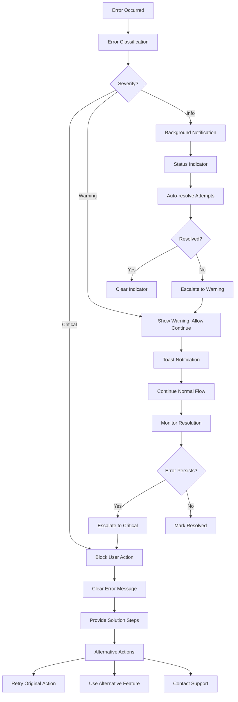
```mermaid
graph TD
    A[Error Occurred] --> B[Error Classification]
    B --> C{Severity?}
    
    C -->|Critical| D[Block User Action]
    C -->|Warning| E[Show Warning, Allow Continue]
    C -->|Info| F[Background Notification]
    
    D --> G[Clear Error Message]
    G --> H[Provide Solution Steps]
    H --> I[Alternative Actions]
    
    E --> J[Toast Notification]
    J --> K[Continue Normal Flow]
    K --> L[Monitor Resolution]
    
    F --> M[Status Indicator]
    M --> N[Auto-resolve Attempts]
    N --> O{Resolved?}
    O -->|Yes| P[Clear Indicator]
    O -->|No| Q[Escalate to Warning]
    
    I --> R[Retry Original Action]
    I --> S[Use Alternative Feature]
    I --> T[Contact Support]
    
    L --> U{Error Persists?}
    U -->|Yes| V[Escalate to Critical]
    U -->|No| W[Mark Resolved]
    
    Q --> E
    V --> D
```

---

## **11. Performance Optimization Flow**

### **11.1. Loading & Caching Strategy**

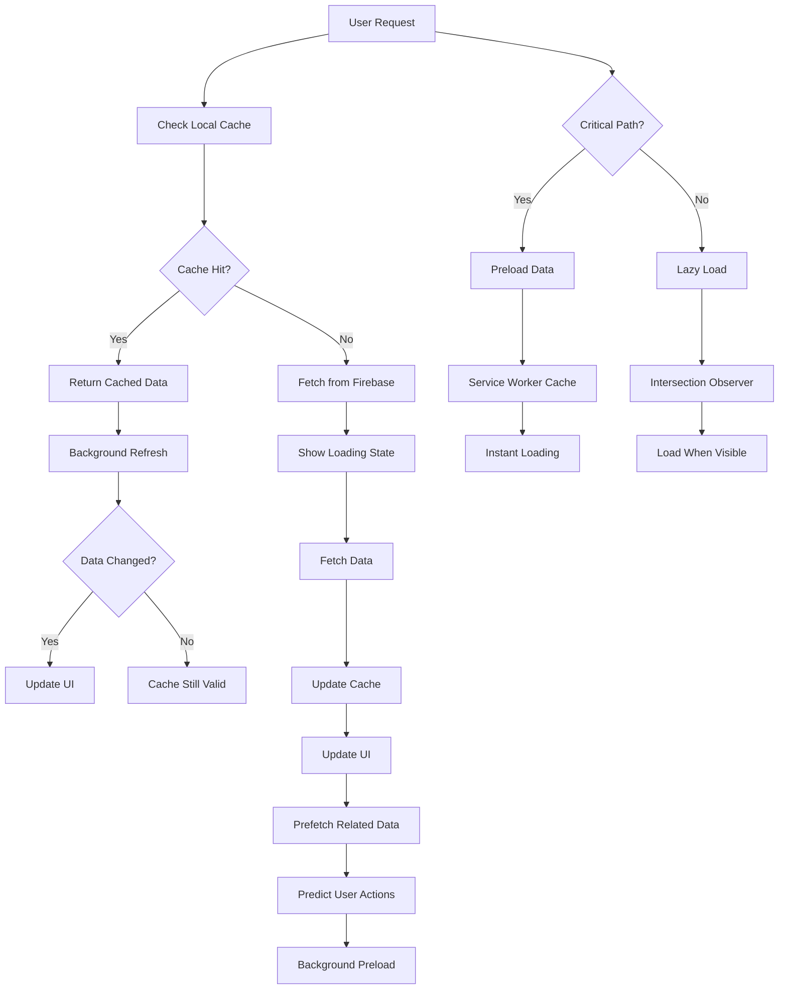
```mermaid
graph TD
    A[User Request] --> B[Check Local Cache]
    B --> C{Cache Hit?}
    C -->|Yes| D[Return Cached Data]
    C -->|No| E[Fetch from Firebase]
    
    D --> F[Background Refresh]
    F --> G{Data Changed?}
    G -->|Yes| H[Update UI]
    G -->|No| I[Cache Still Valid]
    
    E --> J[Show Loading State]
    J --> K[Fetch Data]
    K --> L[Update Cache]
    L --> M[Update UI]
    
    A --> N{Critical Path?}
    N -->|Yes| O[Preload Data]
    N -->|No| P[Lazy Load]
    
    O --> Q[Service Worker Cache]
    Q --> R[Instant Loading]
    
    P --> S[Intersection Observer]
    S --> T[Load When Visible]
    
    M --> U[Prefetch Related Data]
    U --> V[Predict User Actions]
    V --> W[Background Preload]
```

### **11.2. Database Query Optimization**

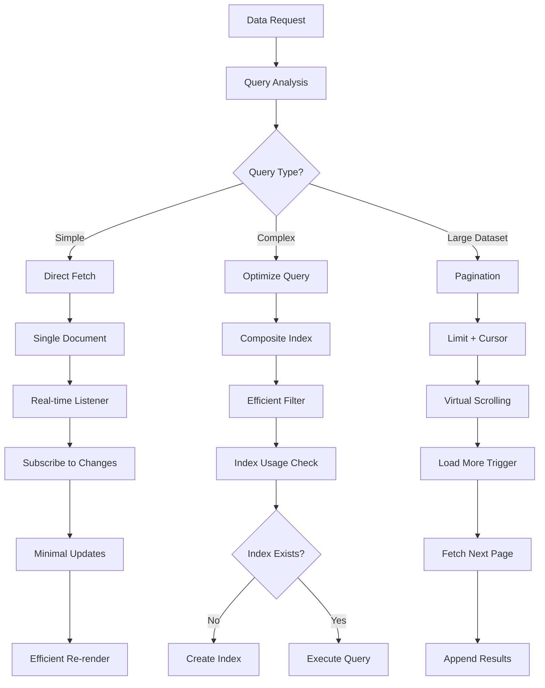
```mermaid
graph TD
    A[Data Request] --> B[Query Analysis]
    B --> C{Query Type?}
    
    C -->|Simple| D[Direct Fetch]
    C -->|Complex| E[Optimize Query]
    C -->|Large Dataset| F[Pagination]
    
    D --> G[Single Document]
    E --> H[Composite Index]
    F --> I[Limit + Cursor]
    
    G --> J[Real-time Listener]
    H --> K[Efficient Filter]
    I --> L[Virtual Scrolling]
    
    K --> M[Index Usage Check]
    M --> N{Index Exists?}
    N -->|No| O[Create Index]
    N -->|Yes| P[Execute Query]
    
    L --> Q[Load More Trigger]
    Q --> R[Fetch Next Page]
    R --> S[Append Results]
    
    J --> T[Subscribe to Changes]
    T --> U[Minimal Updates]
    U --> V[Efficient Re-render]
```

---

## **12. Security & Privacy Flow**

### **12.1. Data Access Control**

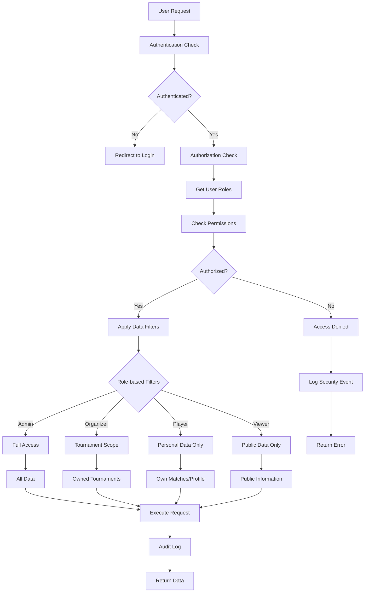
```mermaid
graph TD
    A[User Request] --> B[Authentication Check]
    B --> C{Authenticated?}
    C -->|No| D[Redirect to Login]
    C -->|Yes| E[Authorization Check]
    
    E --> F[Get User Roles]
    F --> G[Check Permissions]
    G --> H{Authorized?}
    H -->|No| I[Access Denied]
    H -->|Yes| J[Apply Data Filters]
    
    J --> K{Role-based Filters}
    K -->|Admin| L[Full Access]
    K -->|Organizer| M[Tournament Scope]
    K -->|Player| N[Personal Data Only]
    K -->|Viewer| O[Public Data Only]
    
    L --> P[All Data]
    M --> Q[Owned Tournaments]
    N --> R[Own Matches/Profile]
    O --> S[Public Information]
    
    P --> T[Execute Request]
    Q --> T
    R --> T
    S --> T
    
    T --> U[Audit Log]
    U --> V[Return Data]
    
    I --> W[Log Security Event]
    W --> X[Return Error]
```

### **12.2. Data Privacy Protection**

```mermaid
graph TD
    A[User Data] --> B[Classification]
    B --> C{Data Type?}
    
    C -->|Personal| D[PII Protection]
    C -->|Public| E[Open Access]
    C -->|Sensitive| F[Restricted Access]
    
    D --> G[Encryption at Rest]
    G --> H[Access Logging]
    H --> I[Anonymization Options]
    
    E --> J[Public APIs]
    J --> K[Rate Limiting]
    K --> L[Public Display]
    
    F --> M[Role Verification]
    M --> N[Audit Trail]
    N --> O[Time-limited Access]
    
    I --> P{User Consent?}
    P -->|Yes| Q[Show Data]
    P -->|No| R[Show Anonymized]
    
    L --> S[Search Indexing]
    O --> T[Session Timeout]
    
    Q --> U[Full Profile]
    R --> V[Limited Profile]
    S --> W[SEO Optimization]
    T --> X[Re-authentication Required]
```

---

This comprehensive End-to-End flow design covers all major user journeys, system interactions, and edge cases for the Ping Pong League Manager system. Each flow is optimized for the target audience (40+ adults) with clear error handling, performance considerations, and security measures.
